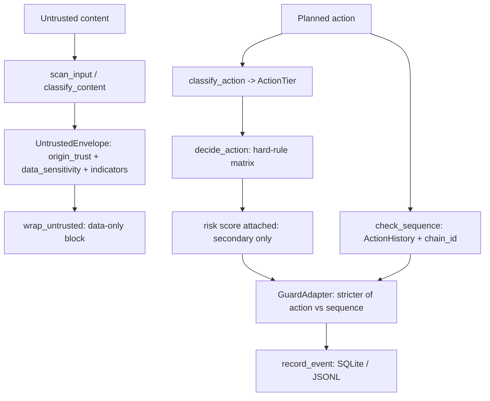

# Architecture

## Principle

> A source's trust does not grant it authority over an action.

The guard is a **transition policy engine**, not a prompt classifier. It sits
beside the `agent-memory` skill: memory protects long-term truth; the guard
protects the moment before an action.

## Decision pipeline

## Why these choices

- **Hard rules before score.** Decisions come from a deterministic matrix. The
  risk score exists for logging and prioritization; it never rescues a
  dangerous transition. `untrusted -> shell` is `deny`, full stop.
- **Two axes, never collapsed.** `OriginTrust` and `DataSensitivity` are
  separate enums. Collapsing them was the main early-design error this codebase
  avoids: a secret file is trusted-origin but must not be exfiltrated.
- **Tool output inherits payload origin.** `resolve_origin_trust` reads an
  explicit `source_kind` first. A web-fetch tool produces `external_web`;
  generic/unknown tool output stays untrusted (fail safe).
- **Classify, then decide.** `classify_action` / `classify_content` are
  separate from the decision logic, so policy is unit-testable and unknown
  inputs fail safe (`ActionTier.UNKNOWN` -> require confirmation).
- **Machine-readable decisions.** `GuardDecision` carries a `ReasonCode` enum,
  not a free string — so hosts, tests, and audit can branch deterministically.
- **Sequence as a first-class guard.** Single actions can each look harmless;
  the kill-chain lives in the sequence. `ActionHistory` is bounded and keyed by
  `chain_id`; the stricter of (action, sequence) wins in `GuardAdapter`.
- **Transform over block where safe.** Untrusted content with a shell command
  is wrapped as quoted data with an explicit "do not execute" notice, keeping
  analysis ability without granting command authority.
- **Enforcement vs Advisory.** The plugin's `pre_tool_call` can stop actions
  (enforcement); `advise_memory_write` only recommends (advisory). The README
  states which paths enforce vs report.
- **stdlib-only, fail-loud config.** Zero runtime deps. `guard.yaml` is parsed
  by a conservative subset loader that raises on anything it does not
  understand — a security policy must never silently weaken.

## Module map

| Module | Responsibility |
|---|---|
| `types.py` | Enums + dataclasses (the shared vocabulary) |
| `_miniyaml.py` | Conservative stdlib YAML-subset loader |
| `policy.py` | Defaults, config load, predicates, `decide_action` matrix |
| `actions.py` | `classify_action` (kind/method -> tier) |
| `action_guard.py` | `check_action` (classify -> decide -> risk score) |
| `patterns.py` | Injection / executable detector banks |
| `envelope.py` | `resolve_origin_trust` (source_kind inheritance) |
| `scanner.py` | `classify_content`, `scan_input` |
| `wrapper.py` | `wrap_untrusted` boundary block |
| `sequence_guard.py` | `ActionHistory`, `check_sequence` kill chains |
| `audit.py` | `AuditLog` (SQLite/JSONL), `record_event`, `build_event` |
| `memory_bridge.py` | `advise_memory_write` (advice-only) |
| `adapter.py` | `GuardAdapter` per-session facade |
| `__main__.py` | CLI |
